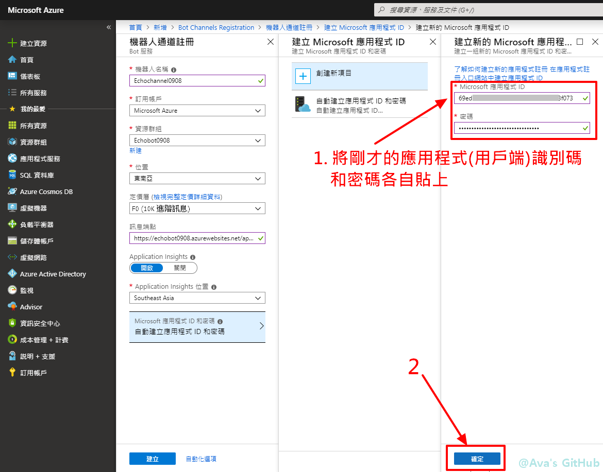
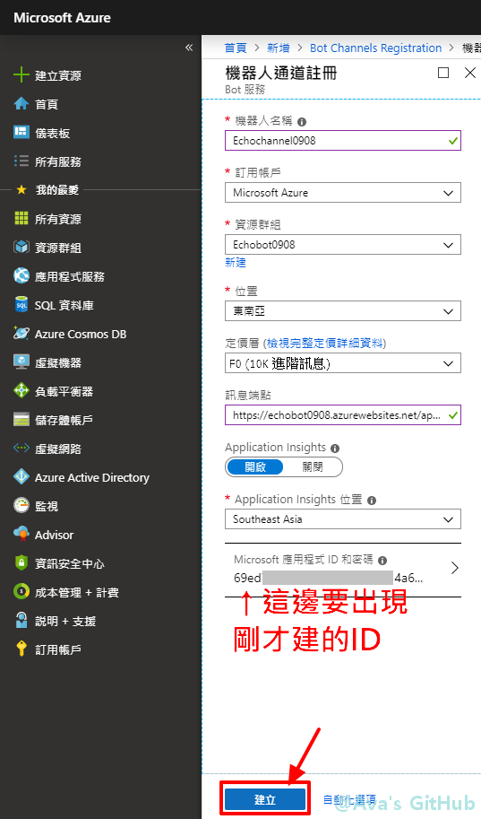

# 目錄
### Part01: [準備工具](https://github.com/avacheng/chatbotdemo/blob/master/Day0907.md#Part01)
- 安裝 Visual Studio 2019 community (.Net Core 2.1)
- 安裝 Bot Framework SDK
- 安裝模擬器
### Part02: [9/7 建置流程](https://github.com/avacheng/chatbotdemo/blob/master/Day0907.md#Part02)

* * *

# Part01
準備工具
## 1. 如果還沒有 Visual Studio，先安裝 [Visual Studio 2019 community](https://visualstudio.microsoft.com/zh-hant/vs/)

* * *

* * *

* * *
## 1.1 如果有 Visual Studio

* * *

* * *
## 1.2 繼續安裝 Visual Studio (.Net Core 2.1)

* * *
安裝完成，可以將安裝程式關閉 

* * *
## 2. 安裝 [Bot Framework SDK](https://marketplace.visualstudio.com/items?itemName=BotBuilder.botbuilderv4)

* * *

* * *

* * *
## 3. 安裝[BotFramework-Emulator模擬器](https://github.com/Microsoft/BotFramework-Emulator/releases)

* * *

* * *

* * *

* * *

* * *

* * *

# Part02
9/7 建置流程
## 可開啟一個文字檔，將以下文字(1)-(4)複製過去，後續根據畫面提示複製或貼上文字
#### (1) http://localhost:3978/api/messages
#### (2) https://機器人名稱.azurewebsites.net/api/messages
#### (3) ID:
#### (4) Password:

* * *
開啟 Visual Studio 2019/2017 (圖片為2019畫面) 

* * *
選擇建立新專案 

* * *
搜尋echo，選擇Echo Bot(Bot Framework v4)這個範本來建立機器人主體 

* * *
自訂機器人名稱，設定容易找到的資料夾目錄 

* * *
進入偵錯模式，在本機模擬機器人的運行 

* * *
等待瀏覽器跳出下圖畫面，如果上方網址數字非3978，修改文字檔(1)和網址數字同 

* * *
開啟Bot Framework Emulator (V4) 對話介面模擬器 

* * *
點選新增設定檔 

* * *
名稱自訂，網址從文字檔(1)複製貼上 

* * *
儲存檔案 

* * *
測試範本機器人 

* * *
回到 Visual studio，關閉偵錯狀態 

* * *
進到屬性頁面 

* * *
確認 目標Framework 為 .Net Core 2.1 

* * *
開啟瀏覽器，進到[Azure](https://azure.microsoft.com/zh-tw/get-started/webinar/on-demand/) 

* * *
點選左上方「建立資源」 

* * *
搜尋 Web App 

* * *
按下「建立」 

* * *
新建資源群組 

* * *
設定機器人資料，名稱設定好號，請複製到文字檔(2)，取代「機器人名稱」這幾個字 

* * *
修改定價層 

* * *
檢閱及建立 

* * *
建立 

* * *
前往資源(如果看不到「前往資源」，可能是資源還在建立中，請等待一下，或者從下圖「補充」前往資源看看) 

* * *
補充：透過資源群組尋找資源 

* * *
補充：尋找 App Service 

* * *
取得發行設定檔 

* * *
存檔 

* * *
回到 Visual Studio，找到方案總管 

* * *
點選「發行」 

* * *
匯入設定檔 

* * *
選擇剛才下載的設定檔 

* * *
修改為 Web Deploy 

* * *
將機器人程式碼發佈到公開URL上 

* * *
發佈成功出現的畫面 

* * *
回到 Azure 來建立機器人通道註冊 

* * *
點選建立 

* * *
依照提示設定機器人通道註冊，其中第 5 項請複製 文字檔(2) 貼入即可 

* * *
建立應用程式ID 

* * *
新增應用程式註冊 

* * *
依圖設定 

* * *
請複製應用程式(用戶端)識別碼到文字檔(3) 

* * *
在憑證及祕密新增用戶端密碼 

* * *
依圖設定來產生新密碼 

* * *
複製密碼貼到文字檔(4) 

* * *
將文字檔(3)(4)依序貼到 ID 和 密碼 欄位，然後按確定 

* * *
檢查設定無誤後，按建立 

* * *
回到 Visual Studio，將文字檔(3)(4)依序貼到 appsettings.json 的 MicrosoftAppId 和 MicrosoftAppPassword 欄位，然後儲存檔案 

* * *
方案總管→發行 

* * *
發行機器人程式碼 

* * *
回到 Azure，找到資源「機器人通道註冊」 

* * *
在 WebChat 中測試 

* * *
輸入文字測試是否正常運作 

* * *
修改模擬器的設定：回到 Visual Studio，進入偵錯模式 

* * *
開啟模擬器 

* * *
左邊選單滑鼠右鍵，選擇第三項，來修改模擬器設定檔 

* * *
將文字檔(3)(4)依序貼到 Application Id 和 Application Password 欄位，然後按確定 

* * *
左邊選單滑鼠右鍵，選擇第一項 

* * *
測試在模擬器介面中是否正常運作 

