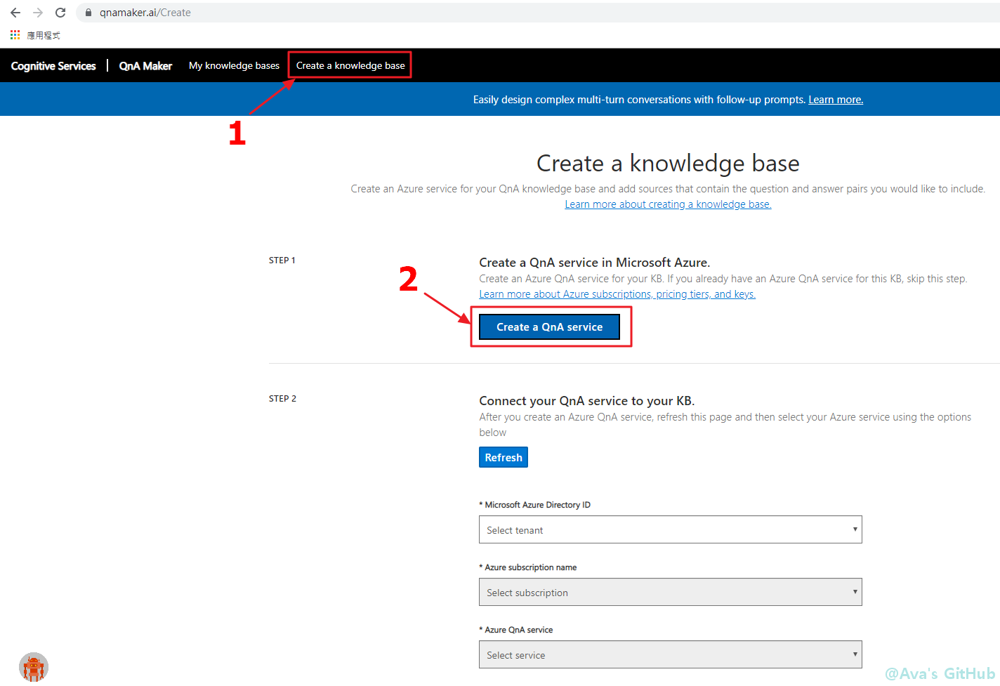
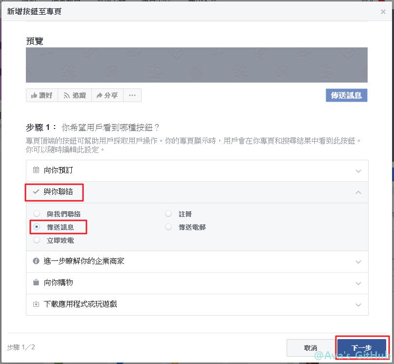

# 9/21 建置流程
# 目錄
### Part01: [建置問與答知識庫](https://github.com/avacheng/chatbotdemo/blob/master/Day0921.md#Part01)
### Part02: [建立臉書和機器人溝通的機器人通道](https://github.com/avacheng/chatbotdemo/blob/master/Day0921.md#Part02)
### Part03: [建立 Line 和機器人溝通的機器人通道](https://github.com/avacheng/chatbotdemo/blob/master/Day0921.md#Part03)
### Part04: [建立 LUIS 服務](https://github.com/avacheng/chatbotdemo/blob/master/Day0921.md#Part04)
### Part05: [對話紀錄的查詢與儲存](https://github.com/avacheng/chatbotdemo/blob/master/Day0921.md#Part05)
### Part06: [取得使用者回饋](https://github.com/avacheng/chatbotdemo/blob/master/Day0921.md#Part06)
### Part07: [附錄：json資料格式參考 & 主動推播](https://github.com/avacheng/chatbotdemo/blob/master/Day0921.md#Part07)

* * * 
1. 範例中 appsettings.json 裡的參數為明碼顯示，在生產環境中應進一步處理以確保資訊安全，參考["微軟說明文件"](https://docs.microsoft.com/zh-tw/azure/app-service/configure-common#configure-app-settings)、["使用 Microsoft Azure App Service 放網站很開心，但資安問題呢？"](https://www.demo.tc/post/826)
2. 如果使用 [EchoBot.cs完整程式碼](https://github.com/avacheng/chatbotdemo/blob/master/EchoBot.cs) ：修改 namespace 的**專案名稱**
```
// 在開頭的 using 段落後找到 namespace
// 將專案名稱替代成自己的專案名稱，類似「namespace EchoBot1.Bots」
namespace 專案名稱.Bots
```
* * *
## Part01
建置 QnA maker 問與答知識庫 https://www.qnamaker.ai/
* * *
登入 [QnA maker](https://www.qnamaker.ai/) 後 (右上角 Sing in 登入) ，建立新的知識庫<br>

* * *
跳到 Azure 頁面，依據說明進行設定<br>

* * *
前往資源 App Service 方案<br>

* * *
將 App Service 方案改為 **F1**<br>

* * *
回到 QnA maker，繼續設定知識庫<br>
在 Step2 依序選擇 Azure 帳戶、註冊名稱和剛才建的問答知識庫資源<br>
Step3 輸入知識庫名稱<br>

* * *
跳過 Step4，到 Step5 ，直接建立知識庫<br>

* * *
將知識庫(問答集)加入表單中<br>
問答範例：<br>
* 請問你們的聯絡電話？<br>
* 線上購物相關諮詢：(02)7705-9688；服務時間：星期一至星期日 早上9:30 – 晚上9:30。\n\n賣場相關諮詢：449-9909(市話請直撥不加區碼，手機撥打請加02)；服務時間：星期一至星期日 早上9:30 – 晚上9:30。\n\n感謝您對於好市多賣場的支持與愛護！\n\n好市多致力於提供會員更舒適的購物環境與愉快的購物體驗，歡迎您的建議與指教。\n\n忙線期間無法儘快提供您服務，\n\n不便之處，懇請見諒包涵!?\n\n好市多客服中心敬上 <br>

* * *
等待訓練完成<br>

* * *
進行測試<br>

* * *
也可以多個問題對一個答案。有修改就要重新訓練。<br>

* * *
如果有整理好的問答集，可在 **settings** 頁面加入，加入後也是需要重新訓練(訓練時間依資料量而定)<br>
範例網頁：<br>
* https://www.costco.com.tw/CustomerServiceFAQMembership<br>
* https://www.costco.com.tw/CustomerServiceFAQOnline<br>
* https://www.costco.com.tw/CustomerServiceFAQWarehouse<br>

* * *
在編輯頁面出現從網頁抓取的內容<br>

* * *
知識庫發行後外部才可使用<br>

* * *
將 Host 和 Post 組成 URI，以及 Endpointkey ，加入程式碼設定檔<br>

* * *
在 VS 設定檔中加入 URI 和 Endpointkey <br>
先將以下程式碼從第一行逗號開始複製，在設定檔第三行最末端貼上，再貼入 URI 和 Endpointkey <br>
```
,
  "QnAEndpointKey": "{QnAEndpointKey}",
  "QnAUri": "{QnAHost}/{QnAPost}",
  "LineAccessToken": "{LineAccessToken}",
  "LuisUri": "{LuisUri}?",
  "LuisKey": "{LuisKey}",
  "SqlConnStr": "{SqlConnStr}"
```
* * *
貼上 URI 和 Endpointkey <br>

* * *
修改 EchoBot.cs 程式碼，使我們可以丟問題給 QnA ，並取得答案<br>
在 public class EchoBot : ActivityHandler{} 大括號內加入以下這一段<br>
```
// 載入設定檔
private readonly IConfiguration _config;
public EchoBot(IConfiguration config)
{
	_config = config;
}

// 建立將「question」文字傳入後，會得到 QnA 答案的方法 (透過 WebAPI 和問答知識庫溝通)
private async Task<string> GetQnAResponse(string question)
{
	using (var client = new HttpClient())
	using (var request = new HttpRequestMessage())
	{
		request.Method = HttpMethod.Post;
		request.RequestUri = new Uri(_config["QnAUri"]);
		request.Content = new StringContent("{question:'" + question + "'}", Encoding.UTF8, "application/json");

		// 注意 "EndpointKey " 字尾有個空白在
		request.Headers.Add("Authorization", "EndpointKey " + _config["QnAEndpointKey"]);

		var response = await client.SendAsync(request);
		var responseBody = await response.Content.ReadAsStringAsync();
		// 解析 QnA maker 傳回來的 json 資料
		return JObject.Parse(responseBody)["answers"][0]["answer"].ToString();
	}
}
```
* * *
OnMembersAddedAsync(){} 用來處理有用戶新加入對話的歡迎訊息，不需要這段，可先註解(如下)<br>
```
//protected override async Task OnMembersAddedAsync(IList<ChannelAccount> membersAdded, ITurnContext<IConversationUpdateActivity> turnContext, CancellationToken cancellationToken)
//{
//    foreach (var member in membersAdded)
//    {
//        if (member.Id != turnContext.Activity.Recipient.Id)
//        {
//            await turnContext.SendActivityAsync(MessageFactory.Text($"Hello and welcome!"), cancellationToken);
//        }
//    }
//}
```
* * *
在 **OnMessageActivityAsync** 處理收到用戶端訊息後相關的流程控制，包含串接各種API或資料儲存或其他應用等。<br>
找到 OnMessageActivityAsync(){} 加入以下這一段，註解(或刪除)預設的 Echo: 回應方式<br>
```
// 建立要傳回訊息到用戶端的連接器 (ConnectorClient)
var connector = new ConnectorClient(new Uri(turnContext.Activity.ServiceUrl), _config["MicrosoftAppId"], _config["MicrosoftAppPassword"]);
// 建立用來回覆訊息的活動物件 (Activity)
var reply = (turnContext.Activity as Activity).CreateReply();
// 取得從用戶端傳來的文字/問題 userWords
string userWords = turnContext.Activity.Text;
// predictionResult 用來紀錄 QnA 或 Luis 的回答
string predictionResult = "";
// Part06 部分：是否建立問卷按鈕 (<<很有用>>等)
bool createButtons = false;
// Part06 部分：是否是用戶端回答問卷
bool answerSurvey = false;

// 先判斷用戶端傳來的不是空字串或空白
if (!string.IsNullOrWhiteSpace(userWords))
{
	// 從 QnA maker 取得答案: 將用戶端文字 userWords 丟進剛才建立的 GetQnAResponse 方法
	predictionResult = await GetQnAResponse(userWords);
	// 如果答案不是「No good match found in KB.」，表示問答知識庫裡有找到適合的配對，就設定回覆的文字為 QnA 拿到的答案
	if (predictionResult != "No good match found in KB.")
	{
		reply = (turnContext.Activity as Activity).CreateReply(predictionResult);
	}

	// 如果先前的流程中沒有找到適合的答案配對，就回答下面的文字
	if (reply.Text.Length == 0)
	{
		reply.Text = "不好意思，機器人客服無法判斷您的意思，請重新說明您的問題";
	}
	
	// 透過連接器回傳訊息給用戶
	await connector.Conversations.ReplyToActivityAsync(reply);
}
// 註解預設的 Echo: 回應方式
//await turnContext.SendActivityAsync(MessageFactory.Text($"Echo: {turnContext.Activity.Text}"), cancellationToken);
```
* * *
進行偵錯<br>

* * *
開啟模擬器，讀取設定檔<br>

* * *
測試是否能順利問答<br>

* * *
測試沒問題後，發行程式碼，上傳到雲端<br>

* * *
到 Azure 機器人通道註冊進行測試<br>

* * *
輸入問題進行測試<br>

* * *
## Part02
建立臉書和機器人溝通的機器人通道
* * *
到 [臉書](https://www.facebook.com/) 建立新的粉絲專頁<br>

* * *
依需求選擇專頁性質<br>

* * *
建立專頁<br>

* * *
專頁建立完成，先放著<br>

* * *
[成為臉書開發人員](https://developers.facebook.com/quickstarts) ，點選建立應用程式<br>

* * *
自訂應用程式名稱<br>

* * *
新增 Messenger<br>

* * *
頁面下拉，找到存取憑證，點選「新增或移除專頁」<br>

* * *

* * *

* * *
找到 Azure 機器人通道會用到的頁面識別碼，並產生憑證<br>

* * *
勾選「我瞭解」，複製憑證<br>

* * *
回到 Azure ，建立和臉書溝通的頻道<br>

* * *
將先前的**頁面識別碼**和**憑證**分別貼上，注意下方還有**URL**和**認證權杖**要貼回FB中<br>

* * *
回到臉書開發人員頁面，點選**新增回調網址**<br>

* * *
兩個欄位分別對應 Azure 機器人通道註冊的 URL 和認證權杖<br>

* * *
完成 webhooks 設定後，點選**新增訂閱**<br>

* * *
勾選前**5**項權限<br>

* * *
到設定的基本資料，將 **應用程式編號** 和 **密鑰**(需先點右邊「顯示」按鈕來顯示明碼) 貼到 Azure 機器人通道註冊中<br>

* * *
完成臉書的頻道設定，按儲存<br>

* * *
回到粉絲專業，在頁面**新增按鈕**<br>

* * *

* * *

* * *

* * *
在「傳送訊息」停留一下，從選單中點選「測試按鈕」<br>

* * *
測試是否能順利問答<br>

* * *
## Part03
建立 Line 和機器人溝通的機器人通道
* * *
到 [Line 的開發人員頁面](https://developers.line.biz/en/services/messaging-api/)<br>

* * *
自訂 Provider 名稱<br>

* * *
（如果有需要選擇 Channel 型態，選 Messaging API）<br>
自訂頻道名稱(7日內不能修改)<br>

* * *
自訂描述與選擇類別<br>

* * *
跳過 URL 部分，往下拉，按「Confirm」<br>

* * *
再次確認資料無誤<br>

* * *
勾選同意使用條款，建立 Line 頻道<br>

* * *
進到新建的頻道中<br>

* * *
在「Change informations」開啟新的分頁，先放著<br>

* * *
往下移，找到 **Channel secret** ，待會貼到 Azure 頻道秘密<br>

* * *
找到 **Channel access token (long-lived)**，取得頻道存取權杖，待會貼到 Azure<br>

* * *
新增 Line 的頻道<br>

* * *
貼上 Line 頁面的 secret 和 token，並將此 Webhook url 貼回 Line 中<br>

* * *
在 Line 中開啟 Use webhooks，並貼上 Azure 的 webhook URL<br>

* * *
繼續下拉，可掃描條碼加入好友<br>

* * *
移到剛才開出的網頁分頁，依據畫面設定回應方式，完成後測試 Line 通道是否順利運行<br>

* * *
回到 VB，修改程式碼 Line 的回應方式為 **reply**（原本用 push 的方式超過額度會收費）：<br>
進到管理 Nuget 套件頁面<br>

* * *
到 NuGet 安裝 LineBotSDK 套件：1.瀏覽 2.搜尋 LineBotSDK 3.選作者為 David Tung 那一項 4.安裝<br>

* * *
安裝完成出現這個說明頁面，可以直接關閉<br>

* * *
在 appsettings.json 貼上 Line 的 token 到參數 LineAccessToken，並修改程式碼 EchoBot.cs，在 OnMessageActivityAsync(){} 中用下段程式取代 `await connector.Conversations.ReplyToActivityAsync(reply);` 這一行<br>
```
// 如果頻道是 line，就用 LineBotSDK 的 reply 方式 (ReplyMessage) 回應，其他頻道不變
if (turnContext.Activity.ChannelId.ToLower() == "line")
{
	isRock.LineBot.Utility.ReplyMessage(reply.ReplyToId, reply.Text, _config["LineAccessToken"]);
}
else
{
	// 透過連接器回傳訊息給用戶
	await connector.Conversations.ReplyToActivityAsync(reply);
}
```
接著到方案總管 Controllers 資料夾下，找到 **BotController.cs**，找到 `PostAsync()`，Task 後面加上 **\<OkResult\>** 和 最後大括號內加上 **return Ok();**<br>
```
[HttpPost]
public async Task<OkResult> PostAsync()
{
	// Delegate the processing of the HTTP POST to the adapter.
	// The adapter will invoke the bot.
	await Adapter.ProcessAsync(Request, Response, Bot);
	return Ok();
}
```
## Part04
建立 [Language Understanding(LUIS)](https://www.luis.ai/home) 服務<br>
* * *
登入 [LUIS](https://www.luis.ai/home) (第一次登入後需要進行註冊)<br>

* * *
如果有出現此畫面，選擇「Migrate Later」<br>

* * *
建立新的app <br>

* * *
第二項 Culture 務必選擇「Chinese」<br>

* * *
建立意向 Intents <br>

* * *
建立意向 Intents，名稱「點餐」<br>

* * *
進到點餐的意向中，輸入用戶可能會用的點餐句子(輸入完成後務必按 Enter 來儲存)<br>
點餐例句：<br>
* 來一份麥克雞<br>
* 兩個飯糰，謝謝<br>
* 三明治和奶茶帶走<br>
* 一杯豆漿<br>
* 我要一個漢堡<br>
* * *
進到 None 的意向中，建立一些例句：<br>
* 你們有賣電腦嗎<br>
* * *
建立實體 Entities<br>

* * *
Simple Entity：例如「餐點」、「飲料」<br>

* * *
Prebuild Entity：例如「number」<br>

* * *
Composite Entity：例如「數量餐點」、「數量飲料」<br>

* * *
到點餐 Intents，可看到 Prebuild Entity 數字部分已自動辨識出來，我們要再標記餐點和飲料這兩個 Simple Entity<br>

* * *
點選關鍵字，使其用 **\[ \]** 框起，再選擇其為餐點或飲料<br>

* * *
標記完成畫面<br>

* * *
繼續標記 Composite Entity 部分。先點數字，選「Wrap in composite entity」<br>

* * *
再點語句的餐點或飲料<br>

* * *
再選數量餐點或數量飲料<br>

* * *
完成後 Composite Entity 畫上綠色底線<br>

* * *
Composite Entity 完成圖<br>

* * *
進行訓練，訓練完後進行測試<br>

* * *
進行測試，測試完發行APP<br>

* * *
發行 APP (staging:暫存；production:生產環境)<br>

* * *
到 Azure Resources 資源，複製 **示例查詢 Example Query**(到 **?** 前) 和 **主密鑰 Primary key** 到 Visual Studio 的設定檔，參數分別為 LuisUri 和 LuisKey<br>

* * *
修改程式碼 EchoBot.cs，可丟語句到 LUIS 並取得解析結果<br>
在 public class EchoBot : ActivityHandler{} 加入以下這一段<br>
```
// Luis只負責解析文字，回應方式須再依解析結果另行設計
// 此範例 GetLUISPrediction 中將文字 text 丟入此方法中，最後產生一個字典來存放 Luis 丟回的 Intents 和 Entities
private async Task<Dictionary<string, string>> GetLUISPrediction(string text)
{
	using (var client = new HttpClient())
	{
		var queryString = HttpUtility.ParseQueryString(string.Empty);
		// Request headers
		client.DefaultRequestHeaders.Add("Ocp-Apim-Subscription-Key", _config["LuisKey"]);
		// Request parameters
		queryString["verbose"] = "true";
		queryString["staging"] = "true";
		var uri = _config["LuisUri"] + queryString;

		HttpResponseMessage response;
		byte[] byteData = Encoding.UTF8.GetBytes("\"" + text + "\"");
		using (var content = new ByteArrayContent(byteData))
		{
			response = await client.PostAsync(uri, content);
			var result = await response.Content.ReadAsStringAsync();
			var jsonObject = JObject.Parse(result);
			string intent = jsonObject["intents"][0]["intent"].ToString();
			string entity = "但是我無法進一步分析" + intent;
			if (jsonObject.ContainsKey("compositeEntities"))
			{
				entity = jsonObject["compositeEntities"][0]["value"].ToString();
			}
			else
			{
				if (jsonObject["entities"].Count() > 0)
				{
					entity = jsonObject["entities"][0]["entity"].ToString();
				}
			}
			return new Dictionary<string, string>()
			{ {"Intent", intent},
			  {"Entity", entity}};
		}
	}
}
```
* * *
在 OnMessageActivityAsync(){} 調整流程，此範例是在進入問答知識庫前先丟入 Luis 分析<br>
```
// 將用戶端文字丟入 GetLUISPrediction
// 如果不是 None，就依照 Luis 分析結果產生固定的回應方式 (OK，你想要...)
var luisPredction = await GetLUISPrediction(userWords);
if (luisPredction["Intent"] != "None")
{
	predictionResult = "OK，你想要" + luisPredction["Intent"] + "，" + luisPredction["Entity"];
	reply.Text = predictionResult;
}
else
{
	// 如果 Luis 取得的 intent 意向為 None，接著丟到問答知識庫繼續分析
	// 從 QnA maker 取得答案: 將用戶端文字 userWords 丟進剛才建立的 GetQnAResponse 方法
	predictionResult = await GetQnAResponse(userWords);
	// 如果答案不是「No good match found in KB.」，表示問答知識庫裡有找到適合的配對，就設定回覆的文字為 QnA 拿到的答案
	if (predictionResult != "No good match found in KB.")
	{
		reply = (turnContext.Activity as Activity).CreateReply(predictionResult);
	}
}
```
* * *
在模擬器進行測試，測試沒問題發行到 Azure 雲端<br>
實測例句<br>
* 紅茶兩杯<br>
* 三明治和奶茶帶走<br>
* 我想要三份蛋餅<br>
* * *
## Part05
對話紀錄的查詢與儲存
* * *
QnA 部分，在 Azure 的 Application Insights 可以查詢紀錄<br>

* * *
進入「記錄(分析)」<br>

* * *
貼上查詢範例如下，執行查詢
```
requests
| where url endswith "generateAnswer"
| project timestamp, id, name, resultCode, duration
| parse name with *"/knowledgebases/"KbId"/generateAnswer"
| join kind= inner (
traces | extend id = operation_ParentId
) on id
| extend question = tostring(customDimensions['Question'])
| extend answer = tostring(customDimensions['Answer'])
| project KbId, timestamp, resultCode, duration, question, answer
```

* * *
在 Azure 建立 SQL 資料庫來儲存對話紀錄<br>

* * *

* * *

* * *

* * *
取得 SQL 資料庫的連線字串，填入 VS 設定檔 SqlConnStr 中，並取代帳號、密碼部分(不須保留大括號)<br>
（如果本身有對外連接的 SQL 資料庫可以使用，就將此 SqlConnStr 替換即可）<br>

* * *
進到 SQL 資料庫<br>

* * *
新增資料表，建立欄位如：時間、來源、使用者 ID 、使用者名稱 、使用者問題、機器回答、 Json 等欄位<br>
```
CREATE TABLE ChatRecords (
    Id int IDENTITY(1,1) NOT NULL PRIMARY KEY,
    Channel varchar(50) NOT NULL,
    UserId varchar(255) NOT NULL,
    UserName nvarchar(255),
    UserRequest nvarchar(2000) NOT NULL,
    BotResponse nvarchar(2000) NOT NULL,
    RequestJson nvarchar(4000) NOT NULL,
    Created datetime,
    SurveyAns nvarchar(100),
    Surveyed datetime,
);
```

* * *
在 VS 中新增程式碼，用來將對話存到 SQL 資料庫<br>
在 public class EchoBot : ActivityHandler{} 加入以下這一段<br>
```
// 將對話存到 SQL 資料庫
private void CollectRequestData(ITurnContext<IMessageActivity> turnContext, string answer)
{
	// Convert UTC Time to Taipei Time
	DateTime timeUtc = DateTime.UtcNow;
	TimeZoneInfo taipeiZone = TimeZoneInfo.FindSystemTimeZoneById("Taipei Standard Time");
	DateTime taipeiTime = TimeZoneInfo.ConvertTimeFromUtc(timeUtc, taipeiZone);
	var json = JsonConvert.SerializeObject(turnContext.Activity);

	string cmdText = "INSERT INTO [ChatRecords] ([Channel],[UserId],[UserName],";
	cmdText += "[UserRequest],[BotResponse],[RequestJson],[Created],[SurveyAns],[Surveyed]) ";
	cmdText += "VALUES (@Channel,@UserId,@UserName,@UserRequest,@BotResponse,@RequestJson,@Created,'',@Created);";

	using (SqlCommand cmd = new SqlCommand())
	{
		cmd.CommandText = cmdText;
		cmd.CommandType = CommandType.Text;
		cmd.Parameters.Add("@Channel", SqlDbType.VarChar).Value = turnContext.Activity.ChannelId;
		cmd.Parameters.Add("@UserId", SqlDbType.VarChar).Value = turnContext.Activity.From.Id;
		cmd.Parameters.Add("@UserName", SqlDbType.NVarChar).Value = turnContext.Activity.From.Name;
		cmd.Parameters.Add("@UserRequest", SqlDbType.NVarChar).Value = turnContext.Activity.Text;
		cmd.Parameters.Add("@BotResponse", SqlDbType.NVarChar).Value = answer;
		cmd.Parameters.Add("@RequestJson", SqlDbType.NVarChar).Value = json;
		cmd.Parameters.Add("@Created", SqlDbType.DateTime).Value = taipeiTime;
		using (SqlConnection con = new SqlConnection(_config["SqlConnStr"]))
		{
			cmd.Connection = con;
			con.Open();
			cmd.ExecuteNonQuery();
		}
	}
}
```
* * *
在 OnMessageActivityAsync(){} 尾端加入以下這一段，完成後發行程式碼<br>
```
// 將對話存到 SQL 資料庫
CollectRequestData(turnContext, predictionResult);
```
* * *
將 Azure IP 加入防火牆允許範圍後，在臉書或 Line 上測試看看<br>

* * *
## Part06
取得使用者回饋
* * *
在 OnMessageActivityAsync(){} 取代原本的回應方式，可以用 Card/Template 功能加上按鈕 (用變數 createButtons 控制) 或是原本的單純回應文字<br>
```
// 如果頻道是 line，就用 LineBotSDK 的 reply 方式 (ReplyMessage) 回應，其他頻道不變
if (turnContext.Activity.ChannelId.ToLower() == "line")
{
	// LINE Templates 手機上無法顯示
	// LINE ButtonsTemplate 有字數限制 (約50字) ，所以先將回應格式化成純文字(去除html標籤等)，只保留主要的回應內容
	string puretext = System.Text.RegularExpressions.Regex.Replace(reply.Text, "<.*?>", string.Empty);
	if (createButtons && puretext.Length <= 50)
	{
		var ButtonsTemplateMsg = new isRock.LineBot.ButtonsTemplate();
		ButtonsTemplateMsg.text = puretext + "請問有幫助到您嗎?";
		ButtonsTemplateMsg.title = "查詢回覆";
		var actions = new List<isRock.LineBot.TemplateActionBase>();
		actions.Add(new isRock.LineBot.MessageAction() { label = "<<很有用>>", text = "<<很有用>>" });
		actions.Add(new isRock.LineBot.MessageAction() { label = "<<普通>>", text = "<<普通>>" });
		actions.Add(new isRock.LineBot.MessageAction() { label = "<<再加強>>", text = "<<再加強>>" });
		ButtonsTemplateMsg.actions = actions;
		isRock.LineBot.Utility.ReplyTemplateMessage(reply.ReplyToId, ButtonsTemplateMsg, _config["LineAccessToken"]);
	}
	else
	{
		isRock.LineBot.Utility.ReplyMessage(reply.ReplyToId, reply.Text, _config["LineAccessToken"]);
	}
}
else
{
	if (createButtons)
	{
		reply = (turnContext.Activity as Activity).CreateReply(reply.Text + "\n\n請問有幫助到您嗎?");
		reply.SuggestedActions = new SuggestedActions()
		{
			Actions = new List<CardAction>()
			{
				new CardAction() { Title = "<<很有用>>", Type = ActionTypes.ImBack, Value = "<<很有用>>" },
				new CardAction() { Title = "<<普通>>", Type = ActionTypes.ImBack, Value = "<<普通>>" },
				new CardAction() { Title = "<<再加強>>", Type = ActionTypes.ImBack, Value = "<<再加強>>" }
			},
		};
	}
	// 透過連接器回傳訊息給用戶
	await connector.Conversations.ReplyToActivityAsync(reply);
}
```
* * *
當使用者回饋後，讀取使用者最後一次的對話 key 值，再將調查結果和回覆時間更新到 SQL 資料表內 (先前預先產生的 SurveyAns 和 Surveyed 欄位)<br>
```
// 將調查結果和回覆時間更新到 SQL 資料表
private void CollectSurveyData(ITurnContext<IMessageActivity> turnContext, string result)
{
	DateTime timeUtc = DateTime.UtcNow;
	TimeZoneInfo taipeiZone = TimeZoneInfo.FindSystemTimeZoneById("Taipei Standard Time");
	DateTime taipeiTime = TimeZoneInfo.ConvertTimeFromUtc(timeUtc, taipeiZone);

	string cmdText = "WITH temp AS (SELECT MAX(Id)maxid FROM ChatRecords WHERE Channel=@Channel AND UserId=@UserId)";
	cmdText += "UPDATE ChatRecords SET SurveyAns=@SurveyAns, Surveyed=@Surveyed ";
	cmdText += "FROM ChatRecords INNER JOIN temp ON Id = maxid WHERE SurveyAns='';";

	using (SqlCommand cmd = new SqlCommand())
	{
		cmd.CommandText = cmdText;
		cmd.CommandType = CommandType.Text;
		cmd.Parameters.Add("@Channel", SqlDbType.VarChar).Value = turnContext.Activity.ChannelId;
		cmd.Parameters.Add("@UserId", SqlDbType.VarChar).Value = turnContext.Activity.From.Id;
		cmd.Parameters.Add("@SurveyAns", SqlDbType.NVarChar).Value = result;
		cmd.Parameters.Add("@Surveyed", SqlDbType.DateTime).Value = taipeiTime;
		using (SqlConnection con = new SqlConnection(_config["SqlConnStr"]))
		{
			cmd.Connection = con;
			con.Open();
			cmd.ExecuteNonQuery();
		}
	}
}
```
* * *
在 OnMessageActivityAsync(){} 進入QaA、LUIS流程前加入以下這一段<br>
因為按鈕是 `<< >>` 的形式，所以用 `if (userWords.StartsWith("<<") && userWords.EndsWith(">>"))` 來判斷是否為回應我們的問卷<br>
```
if (userWords.StartsWith("<<") && userWords.EndsWith(">>"))
{
	// 如果是回答問卷，則謝謝用戶
	reply.Text = "謝謝您！歡迎繼續發問喔！";
	answerSurvey = true;
}
else
{
	// 將用戶端文字丟入 GetLUISPrediction
	// todo ...
}
```
* * *
修改最後儲存資料部分，在原有的儲存對話與活動紀錄 **CollectRequestData** 之外，另加上儲存使用者回饋 **CollectSurveyData** 的方法<br>
```
if (answerSurvey)
{
	// 將用戶回饋/問卷結果儲存到資料表
	CollectSurveyData(turnContext, userWords);
}
else
{
	// 將對話存到 SQL 資料庫
	CollectRequestData(turnContext, predictionResult);
}
```
* * *
在模擬器測試無誤後，發行到 Azure 上<br>
* * *
## Part07
附錄：在 **頻道和機器人** 或 **機器人和 QnA 或 Luis** 間溝通使用 json 來傳遞資料，格式範例如下，可貼到 [Json Parser](http://json.parser.online.fr/) (左方空格)整理成比較好理解的排列方式<br>
1：從 BotChannel 傳來的 json 資料格式 ( 用 turnContext.Activity.xxx 取得項目值 )<br>
```
{"type":"message","id":"xxxxxxxx-xxxx-xxxx-xxxx-xxxxxxxxxxxx","timestamp":"2019-08-06T12:16:09.216+00:00","localTimestamp":"2019-08-06T20:16:09+08:00","localTimezone":null,"serviceUrl":"http://localhost:51088","channelId":"emulator","from":{"id":"xxxxxxxx-xxxx-xxxx-xxxx-xxxxxxxxxxxx","name":"User","aadObjectId":null,"role":"user"},"conversation":{"isGroup":null,"conversationType":null,"id":"xxxxxxxx-xxxx-xxxx-xxxx-xxxxxxxxxxxx|livechat","name":null,"aadObjectId":null,"role":null,"tenantId":null},"recipient":{"id":"xxxxxxxx-xxxx-xxxx-xxxx-xxxxxxxxxxxx","name":"Bot","aadObjectId":null,"role":"bot"},"textFormat":"plain","attachmentLayout":null,"membersAdded":null,"membersRemoved":null,"reactionsAdded":null,"reactionsRemoved":null,"topicName":null,"historyDisclosed":null,"locale":"en-US","text":"申請會員卡","speak":null,"inputHint":null,"summary":null,"suggestedActions":null,"attachments":null,"entities":null,"channelData":{"clientActivityID":"xxxxxxxxxxxxxxxxxxxxxxxx"},"action":null,"replyToId":null,"label":null,"valueType":null,"value":null,"name":null,"relatesTo":null,"code":null,"expiration":null,"importance":null,"deliveryMode":null,"listenFor":null,"textHighlights":null,"semanticAction":null,"callerId":null}

```
* * *
2：QnA maker 給的 json 回答 ( 用 JObject.Parse 取得項目值 ) <br>
```
{"answers":[{"questions":["好市多會員卡要如何申請？"],"answer":"您可直接至[加入好市多頁面](https://www.costco.com.tw/membership) 立即申辦好市多會員主卡，好市多會員主卡金星會員**及商業會員**兩種。\n\n 金星會員**提供給滿18歲且經由好市多審核通過的一般個人申請，會員年費NT$1,350元。\n\n 商業會員**提供給滿18歲且經由好市多審核通過並符合。\n\n a.所有公司商店行號負責人  b.非營利事業組織之最高職階主管  c.畜牧、農場之負責人之條件者申請，會員年費NT$1,150元。\n\n 線上申辦會員卡接受國泰世華銀行COSTCO聯名卡、國泰世華Visa金融卡以及其他信用卡付款。","score":31.26,"id":26,"source":"Editorial","metadata":[],"context":{"isContextOnly":false,"prompts":[]}}],"debugInfo":null,"activeLearningEnabled":false}

```
* * *
3：LUIS 取得的 json 檔格式範例：<br>
```
{"query":"五杯紅茶","topScoringIntent":{"intent":"點餐","score":0.983032167},"intents":[{"intent":"點餐","score":0.983032167},{"intent":"None","score":0.016564168}],"entities":[{"entity":"紅茶","type":"飲料","startIndex":2,"endIndex":3,"score":0.9817523},{"entity":"五杯紅茶","type":"數量飲料","startIndex":0,"endIndex":3,"score":0.883589447},{"entity":"五","type":"builtin.number","startIndex":0,"endIndex":0,"resolution":{"value":"5"}}],"compositeEntities":[{"parentType":"數量飲料","value":"五杯紅茶","children":[{"type":"builtin.number","value":"五"},{"type":"飲料","value":"紅茶"}]}]}

```
* * *
4：主動推播，以臉書為例，Line 比照修改即可：<br>
在 SQL 資料庫的 RequestJson 欄位可找到FacebookBotName、FacebookBotId、UserName、UserId，參考附錄 1 及下圖<br>
```
// Facebook 主動推播：給訊息文字messageText後，依照此連接器的設定傳給特定的用戶
private async void PushFacebookMessage(string messageText)
{
	// 如果是 line，將後面括號內的 TrustServiceUrl 改為 "https://line.botframework.com/"
	Microsoft.Bot.Connector.Authentication.MicrosoftAppCredentials.TrustServiceUrl("https://facebook.botframework.com/");

	// 在 SQL 資料庫的 RequestJson 欄位可找到所需參數
	// 機器人資訊
	var botAccount = new ChannelAccount(name: "FacebookBotName", id: "FacebookBotId");
	// 用戶端資訊
	var userAccount = new ChannelAccount(name: "UserName", id: "UserId");
	// 如果是 line，將括號內的 Uri 改為 "https://line.botframework.com/"
	var connector = new ConnectorClient(new Uri("https://facebook.botframework.com/"), _config["MicrosoftAppId"], _config["MicrosoftAppPassword"]);
	var conversationId = await connector.Conversations.CreateDirectConversationAsync(botAccount, userAccount);

	IMessageActivity message = Activity.CreateMessageActivity();
	message.From = botAccount;
	message.Recipient = userAccount;
	message.Conversation = new ConversationAccount(id: conversationId.Id);
	message.Text = messageText;
	message.Locale = "en-Us";
	await connector.Conversations.SendToConversationAsync((Activity)message);
}
```

* * *
最後在 OnMessageActivityAsync(){} 加入此段即可進行主動推播訊息給特定的用戶
```
PushFacebookMessage("這是主動推播");
```
