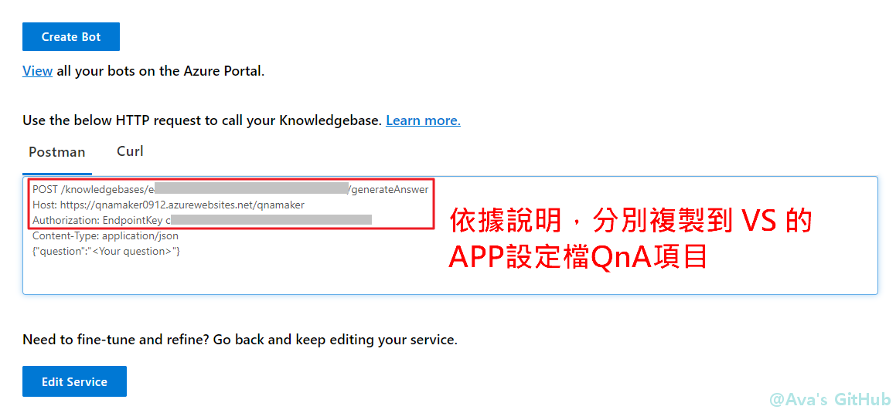
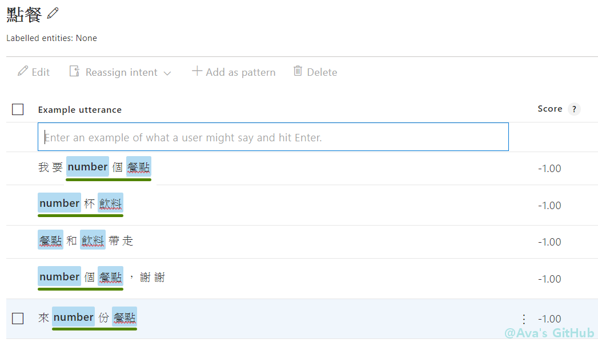

# 9/21 建置流程
# 目錄
### Part01: [建置問與答知識庫](https://github.com/avacheng/chatbotdemo/blob/master/Day0921.md#Part01)
### Part02: [建立臉書和機器人溝通的機器人通道](https://github.com/avacheng/chatbotdemo/blob/master/Day0921.md#Part02)
### Part03: [建立 Line 和機器人溝通的機器人通道](https://github.com/avacheng/chatbotdemo/blob/master/Day0921.md#Part03)
### Part04: [建立 LUIS 服務](https://github.com/avacheng/chatbotdemo/blob/master/Day0921.md#Part04)
### Part05: [對話紀錄的查詢與儲存](https://github.com/avacheng/chatbotdemo/blob/master/Day0921.md#Part05)
### Part06: [取得使用者回饋](https://github.com/avacheng/chatbotdemo/blob/master/Day0921.md#Part06)

* * *
## Part01
建置QnA maker問與答知識庫 https://www.qnamaker.ai/
* * *
登入 [QnA maker](https://www.qnamaker.ai/) 後，建立新的知識庫<br>

* * *
跳到Azure頁面，依據說明進行設定<br>

* * *
資源建立完成後，前往資源<br>

* * *
另一種前往資源的方式<br>

* * *
將App Service方案改為F1<br>

* * *
回到QnA maker，繼續設定知識庫<br>

* * *
建立知識庫<br>

* * *
將知識庫(問答集)加入表單中<br>
問答範例：<br>
* 請問你們的聯絡電話？<br>
* 線上購物相關諮詢：(02)7705-9688；服務時間：星期一至星期日 早上9:30 – 晚上9:30。\n\n賣場相關諮詢：449-9909(市話請直撥不加區碼，手機撥打請加02)；服務時間：星期一至星期日 早上9:30 – 晚上9:30。\n\n感謝您對於好市多賣場的支持與愛護！\n\n好市多致力於提供會員更舒適的購物環境與愉快的購物體驗，歡迎您的建議與指教。\n\n忙線期間無法儘快提供您服務，\n\n不便之處，懇請見諒包涵!?\n\n好市多客服中心敬上 <br>

* * *
等待訓練完成<br>

* * *
進行測試<br>

* * *
也可以多個問題對一個答案。有修改就要重新訓練。<br>

* * *
如果有整理好的問答集，可在 settings 頁面加入，加入後也是需要重新訓練(訓練時間依資料量而定)<br>
範例網頁：<br>
* https://www.costco.com.tw/CustomerServiceFAQMembership<br>
* https://www.costco.com.tw/CustomerServiceFAQOnline<br>
* https://www.costco.com.tw/CustomerServiceFAQWarehouse<br>

* * *
在編輯頁面出現從網頁抓取的內容<br>

* * *
知識庫發行後外部才可使用<br>

* * *
將 Host 和 Post 組成 URI，以及 Endpointkey ，加入程式碼設定檔<br>

* * *
在 VS 設定檔中加入 URI 和 Endpointkey <br>
先將以下程式碼複製貼上(在設定檔第三行最末端貼上)，再貼入 URI 和 Endpointkey <br>
```
,
  "QnAEndpointKey": "{QnAEndpointKey}",
  "QnAUri": "{QnAHost}/{QnAPost}",
  "LineAccessToken": "{LineAccessToken}",
  "LuisUri": "{LuisUri}?",
  "LuisKey": "{LuisKey}",
  "SqlConnStr": "{SqlConnStr}"
```
* * *
貼上 URI 和 Endpointkey <br>

* * *
修改 EchoBot.cs 程式碼，使我們可以丟問題給 QnA ，並取得答案<br>
在 public class EchoBot : ActivityHandler{} 加入以下這一段<br>
```
private readonly IConfiguration _config;
public EchoBot(IConfiguration config)
{
	_config = config;
}

private async Task<string> GetQnAResponse(string question)
{
	using (var client = new HttpClient())
	using (var request = new HttpRequestMessage())
	{
		request.Method = HttpMethod.Post;
		request.RequestUri = new Uri(_config["QnAUri"]);
		request.Content = new StringContent("{question:'" + question + "'}", Encoding.UTF8, "application/json");

		// The value of the header contains the string/text 'EndpointKey ' with the trailing space
		request.Headers.Add("Authorization", "EndpointKey " + _config["QnAEndpointKey"]);

		var response = await client.SendAsync(request);
		var responseBody = await response.Content.ReadAsStringAsync();
		return JObject.Parse(responseBody)["answers"][0]["answer"].ToString();
	}
}
```
* * *
在 OnMessageActivityAsync(){} 加入以下這一段<br>
```
var connector = new ConnectorClient(new Uri(turnContext.Activity.ServiceUrl), _config["MicrosoftAppId"], _config["MicrosoftAppPassword"]);
var reply = (turnContext.Activity as Activity).CreateReply();
string userWords = turnContext.Activity.Text;
string predictionResult;

if (!string.IsNullOrWhiteSpace(userWords))
{
	// Get the answer from the QnA maker
	predictionResult = await GetQnAResponse(userWords);
	if (predictionResult != "No good match found in KB.")
	{
		reply = (turnContext.Activity as Activity).CreateReply(predictionResult);
	}

	if (reply.Text.Length == 0)
	{
		reply.Text = "不好意思，機器人客服無法判斷您的意思，請重新說明您的問題";
	}
	
	await connector.Conversations.ReplyToActivityAsync(reply);
}
```
* * * 
程式碼補充：修改 namespace <br>
```
namespace 專案名稱.Bots
```
* * *
[Json Parser](http://json.parser.online.fr/)<br>
從 BotChannel 傳來的資料 ( 用 turnContext.Activity.xxx 取得項目值 )<br>
```
{"type":"message","id":"xxxxxxxx-xxxx-xxxx-xxxx-xxxxxxxxxxxx","timestamp":"2019-08-06T12:16:09.216+00:00","localTimestamp":"2019-08-06T20:16:09+08:00","localTimezone":null,"serviceUrl":"http://localhost:51088","channelId":"emulator","from":{"id":"xxxxxxxx-xxxx-xxxx-xxxx-xxxxxxxxxxxx","name":"User","aadObjectId":null,"role":"user"},"conversation":{"isGroup":null,"conversationType":null,"id":"xxxxxxxx-xxxx-xxxx-xxxx-xxxxxxxxxxxx|livechat","name":null,"aadObjectId":null,"role":null,"tenantId":null},"recipient":{"id":"xxxxxxxx-xxxx-xxxx-xxxx-xxxxxxxxxxxx","name":"Bot","aadObjectId":null,"role":"bot"},"textFormat":"plain","attachmentLayout":null,"membersAdded":null,"membersRemoved":null,"reactionsAdded":null,"reactionsRemoved":null,"topicName":null,"historyDisclosed":null,"locale":"en-US","text":"申請會員卡","speak":null,"inputHint":null,"summary":null,"suggestedActions":null,"attachments":null,"entities":null,"channelData":{"clientActivityID":"xxxxxxxxxxxxxxxxxxxxxxxx"},"action":null,"replyToId":null,"label":null,"valueType":null,"value":null,"name":null,"relatesTo":null,"code":null,"expiration":null,"importance":null,"deliveryMode":null,"listenFor":null,"textHighlights":null,"semanticAction":null,"callerId":null}

```
* * *
[Json Parser](http://json.parser.online.fr/)<br>
QnA maker 給的回答 ( 用 JObject.Parse 取得項目值 ) <br>
```
{"answers":[{"questions":["好市多會員卡要如何申請？"],"answer":"您可直接至[加入好市多頁面](https://www.costco.com.tw/membership) 立即申辦好市多會員主卡，好市多會員主卡金星會員**及商業會員**兩種。\n\n 金星會員**提供給滿18歲且經由好市多審核通過的一般個人申請，會員年費NT$1,350元。\n\n 商業會員**提供給滿18歲且經由好市多審核通過並符合。\n\n a.所有公司商店行號負責人  b.非營利事業組織之最高職階主管  c.畜牧、農場之負責人之條件者申請，會員年費NT$1,150元。\n\n 線上申辦會員卡接受國泰世華銀行COSTCO聯名卡、國泰世華Visa金融卡以及其他信用卡付款。","score":31.26,"id":26,"source":"Editorial","metadata":[],"context":{"isContextOnly":false,"prompts":[]}}],"debugInfo":null,"activeLearningEnabled":false}

```
* * *
進行偵錯<br>

* * *
開啟模擬器，讀取設定檔<br>

* * *
測試是否能順利問答<br>

* * *
測試沒問題後，發行程式碼，上傳到雲端<br>

* * *
到 Azure 機器人通道註冊進行測試<br>

* * *
一樣輸入問題進行測試<br>

* * *
## Part02
建立臉書和機器人溝通的機器人通道
* * *
到[臉書](https://www.facebook.com/)建立新的粉絲專頁<br>

* * *
選擇專頁性質<br>

* * *
建立專頁<br>

* * *
專頁建立完成，先放著<br>

* * *
成為[FB開發人員](https://developers.facebook.com/quickstarts) ，點選建立應用程式<br>

* * *
自訂應用程式名稱<br>

* * *
新增 Messenger<br>

* * *
頁面下拉，找到存取憑證，點選「新增或移除專頁」<br>

* * *

* * *

* * *
找到 Azure 機器人通道會用到的頁面識別碼，並產生憑證<br>

* * *
勾選「我瞭解」，複製憑證<br>

* * *
回到 Azure ，建立和臉書溝通的頻道<br>

* * *
將先前的頁面識別碼和憑證分別貼上，注意下方還有URL和認證權杖要貼回FB中<br>

* * *
回到FB開發人員頁面，點選新增回調網址<br>

* * *
兩個欄位分別對應 Azure 機器人通道註冊的 URL 和認證權杖<br>

* * *
完成 webhooks 設定後，點選新增訂閱<br>

* * *
勾選前五項權限<br>

* * *
到設定的基本資料，將應用程式編號和密碼貼到 Azure 機器人通道註冊中<br>

* * *
完成FB的頻道設定，按儲存<br>

* * *
回到粉絲專業，在頁面新增按鈕<br>

* * *

* * *

* * *

* * *
測試按鈕<br>

* * *
測試是否能順利問答<br>

* * *
## Part03
建立Line和機器人溝通的機器人通道
* * *
到 Line 的[開發人員頁面](https://developers.line.biz/en/services/messaging-api/)<br>

* * *
自訂 Provider 名稱<br>

* * *
設定頻道名稱<br>

* * *

* * *
跳過 URL 部分，往下拉<br>

* * *
再次確認資料無誤<br>

* * *
勾選同意使用條款，建立 Line 頻道<br>

* * *
進到新建的頻道中<br>

* * *
在「Change informations」開啟新的分頁，先放著<br>

* * *
往下移，找到Channel secret，待會貼到 Azure 頻道秘密<br>

* * *
找到 Channel access token (long-lived)，取得頻道存取權杖，待會貼到 Azure<br>

* * *
新增 Line 的頻道<br>

* * *
貼上 Line 頁面的 secret 和 token，並將此 Webhook url 貼回 Line 中<br>

* * *
在 Line 中開啟 Use webhooks，並貼上 Azure 的 webhook URL<br>

* * *
繼續下拉，可掃描條碼加入好友<br>

* * *
移到剛才開出的網頁分頁，依據畫面設定回應方式，完成後測試 Line 通道是否順利運行<br>

* * *
回到 VB，修改程式碼(EchoBot.cs)，並貼上 Line 的 token 到設定檔 LineAccessToken 參數<br>
```
if (turnContext.Activity.ChannelId.ToLower() == "line")
{
	isRock.LineBot.Utility.ReplyMessage(reply.ReplyToId, reply.Text, _config["LineAccessToken"]);
}
else
{
	await connector.Conversations.ReplyToActivityAsync(reply);
}
```
修改 BotController.cs<br>
```
[HttpPost]
public async Task PostAsync()
{
	// Delegate the processing of the HTTP POST to the adapter.
	// The adapter will invoke the bot.
	await Adapter.ProcessAsync(Request, Response, Bot);
}
```
## Part04
建立[Language Understanding(LUIS)](https://www.luis.ai/home) 服務<br>
* * *
登入[LUIS](https://www.luis.ai/home) <br>

* * *
如果有出現此畫面，選擇「Migrate Later」<br>

* * *
建立新的app <br>

* * *
第二項 Culture 務必選擇「Chinese」<br>

* * *
建立意圖 <br>

* * *
建立意圖，名稱「點餐」<br>

* * *
點餐例句：<br>
* 來一份麥克雞<br>
* 兩個飯糰，謝謝<br>
* 三明治和奶茶帶走<br>
* 一杯豆漿<br>
* 我要一個漢堡<br>
* * *
None 例句：<br>
* 你們有賣電腦嗎<br>
* * *
建立Entities<br>

* * *
Simple Entity：例如「餐點」、「飲料」<br>

* * *
Prebuild Entity：例如「number」<br>

* * *
Composite Entity：例如「數量餐點」、「數量飲料」<br>

* * *
到點餐Intent，可看到Prebuild Entity數字部分已自動辨識出來，我們要再標記餐點和飲料這兩個Simple Entity<br>

* * *
點選關鍵字，使其用 \[ \] 框起，再選擇其為餐點或飲料<br>

* * *
標記完成畫面<br>

* * *
繼續標記Composite Entity部分。先點數字，選「Wrap in composite entity」<br>

* * *
再點語句的餐點或飲料<br>

* * *
再選數量餐點或數量飲料<br>

* * *
完成後Composite Entity畫上綠色底線<br>

* * *
Composite Entity完成圖<br>

* * *
進行訓練，訓練完後進行測試<br>

* * *
進行測試，測試完發行APP<br>

* * *
發行APP<br>

* * *
到 Azure Resources，複製 Example Query 和 Primary key 到 Visual Studio 的設定檔，參數分別為 LuisUri 和 LuisKey<br>

* * *
修改程式碼EchoBot.cs，可丟語句到 LUIS 並取得解析結果<br>
在 public class EchoBot : ActivityHandler{} 加入以下這一段<br>
```
private async Task<Dictionary<string, string>> GetLUISPrediction(string text)
{
	using (var client = new HttpClient())
	{
		var queryString = HttpUtility.ParseQueryString(string.Empty);
		// Request headers
		client.DefaultRequestHeaders.Add("Ocp-Apim-Subscription-Key", _config["LuisKey"]);
		// Request parameters
		queryString["verbose"] = "true";
		queryString["staging"] = "true";
		var uri = _config["LuisUri"] + queryString;

		HttpResponseMessage response;
		byte[] byteData = Encoding.UTF8.GetBytes("\"" + text + "\"");
		using (var content = new ByteArrayContent(byteData))
		{
			response = await client.PostAsync(uri, content);
			var result = await response.Content.ReadAsStringAsync();
			var jsonObject = JObject.Parse(result);
			string intent = jsonObject["intents"][0]["intent"].ToString();
			string entity = "但是我無法進一步分析" + intent;
			if (jsonObject.ContainsKey("compositeEntities"))
			{
				entity = jsonObject["compositeEntities"][0]["value"].ToString();
			}
			else
			{
				if (jsonObject["entities"].Count() > 0)
				{
					entity = jsonObject["entities"][0]["entity"].ToString();
				}
			}
			return new Dictionary<string, string>()
			{ {"Intent", intent},
			  {"Entity", entity}};
		}
	}
}
```
* * *
[Json Parser](http://json.parser.online.fr/)<br>
LUIS 取得的 json 檔格式範例：<br>
```
{"query":"五杯紅茶","topScoringIntent":{"intent":"點餐","score":0.983032167},"intents":[{"intent":"點餐","score":0.983032167},{"intent":"None","score":0.016564168}],"entities":[{"entity":"紅茶","type":"飲料","startIndex":2,"endIndex":3,"score":0.9817523},{"entity":"五杯紅茶","type":"數量飲料","startIndex":0,"endIndex":3,"score":0.883589447},{"entity":"五","type":"builtin.number","startIndex":0,"endIndex":0,"resolution":{"value":"5"}}],"compositeEntities":[{"parentType":"數量飲料","value":"五杯紅茶","children":[{"type":"builtin.number","value":"五"},{"type":"飲料","value":"紅茶"}]}]}

```
* * *
在 OnMessageActivityAsync(){} 加入以下這一段<br>
```
var luisPredction = await GetLUISPrediction(userWords);
if (luisPredction["Intent"] != "None")
{
	predictionResult = "OK，你想要" + luisPredction["Intent"] + "，" + luisPredction["Entity"];
	reply.Text = predictionResult;
}
else
{
	// Get the answer from the QnA maker
	// Todo
}
```
* * *
在模擬器進行測試，測試沒問題發行到 Azure 雲端<br>
實測例句<br>
* 紅茶兩杯<br>
* 三明治和奶茶帶走<br>
* 我想要三份蛋餅<br>
* * *
## Part05
對話紀錄的查詢與儲存
* * *
QnA 部分，在 Azure 的 Application Insights 可以查詢紀錄<br>

* * *
進入「記錄(分析)」<br>

* * *
貼上查詢範例如下，執行查詢
```
requests
| where url endswith "generateAnswer"
| project timestamp, id, name, resultCode, duration
| parse name with *"/knowledgebases/"KbId"/generateAnswer"
| join kind= inner (
traces | extend id = operation_ParentId
) on id
| extend question = tostring(customDimensions['Question'])
| extend answer = tostring(customDimensions['Answer'])
| project KbId, timestamp, resultCode, duration, question, answer
```

* * *
在 Azure 建立 SQL 資料庫來儲存對話紀錄<br>

* * *

* * *

* * *

* * *
取得 SQL 資料庫的連線字串，填入VS設定檔中，並取代帳號、密碼部分<br>

* * *
進到 SQL 資料庫<br>

* * *
新增資料表，建立欄位如：時間、來源、使用者 ID 、使用者名稱 、使用者問題、機器回答、 Json 等欄位<br>
```
CREATE TABLE ChatRecords (
    Id int IDENTITY(1,1) NOT NULL PRIMARY KEY,
    Channel varchar(50) NOT NULL,
    UserId varchar(255) NOT NULL,
    UserName nvarchar(255),
    UserRequest nvarchar(2000) NOT NULL,
    BotResponse nvarchar(2000) NOT NULL,
    RequestJson nvarchar(4000) NOT NULL,
    Created datetime,
    SurveyAns nvarchar(100),
    Surveyed datetime,
);
```

* * *
在 VS 中新增程式碼，將對話存到 SQL 資料庫<br>
在 public class EchoBot : ActivityHandler{} 加入以下這一段<br>
```
private void CollectRequestData(ITurnContext<IMessageActivity> turnContext, string answer)
{
	// Convert UTC Time to Taipei Time
	DateTime timeUtc = DateTime.UtcNow;
	TimeZoneInfo taipeiZone = TimeZoneInfo.FindSystemTimeZoneById("Taipei Standard Time");
	DateTime taipeiTime = TimeZoneInfo.ConvertTimeFromUtc(timeUtc, taipeiZone);
	var json = JsonConvert.SerializeObject(turnContext.Activity);

	string cmdText = "INSERT INTO [ChatRecords] ([Channel],[UserId],[UserName],";
	cmdText += "[UserRequest],[BotResponse],[RequestJson],[Created],[SurveyAns],[Surveyed]) ";
	cmdText += "VALUES (@Channel,@UserId,@UserName,@UserRequest,@BotResponse,@RequestJson,@Created,'',@Created);";

	using (SqlCommand cmd = new SqlCommand())
	{
		cmd.CommandText = cmdText;
		cmd.CommandType = CommandType.Text;
		cmd.Parameters.Add("@Channel", SqlDbType.VarChar).Value = turnContext.Activity.ChannelId;
		cmd.Parameters.Add("@UserId", SqlDbType.VarChar).Value = turnContext.Activity.From.Id;
		cmd.Parameters.Add("@UserName", SqlDbType.NVarChar).Value = turnContext.Activity.From.Name;
		cmd.Parameters.Add("@UserRequest", SqlDbType.NVarChar).Value = turnContext.Activity.Text;
		cmd.Parameters.Add("@BotResponse", SqlDbType.NVarChar).Value = answer;
		cmd.Parameters.Add("@RequestJson", SqlDbType.NVarChar).Value = json;
		cmd.Parameters.Add("@Created", SqlDbType.DateTime).Value = taipeiTime;
		using (SqlConnection con = new SqlConnection(_config["SqlConnStr"]))
		{
			cmd.Connection = con;
			con.Open();
			cmd.ExecuteNonQuery();
		}
	}
}
```
* * *
在 OnMessageActivityAsync(){} 尾端加入以下這一段，完成後發行程式碼<br>
```
CollectRequestData(turnContext, predictionResult);
```
* * *
將 Azure IP 加入防火牆允許範圍後，在 FB 或 Line 上測試看看<br>

* * *
## Part06
取得使用者回饋
* * *
在 OnMessageActivityAsync(){} 加入以下這一段，使用 Card/Template 功能產生按鈕<br>
```
if (turnContext.Activity.ChannelId.ToLower() == "line")
{
	// LINE ButtonsTemplate 有字數限制
	// LINE Templates 手機上無法顯示
	string puretext = System.Text.RegularExpressions.Regex.Replace(reply.Text, "<.*?>", string.Empty);
	if (createButtons && puretext.Length <= 50)
	{
		var ButtonsTemplateMsg = new isRock.LineBot.ButtonsTemplate();
		ButtonsTemplateMsg.text = puretext + "請問有幫助到您嗎?";
		ButtonsTemplateMsg.title = "查詢回覆";
		var actions = new List<isRock.LineBot.TemplateActionBase>();
		actions.Add(new isRock.LineBot.MessageAction() { label = "<<很有用>>", text = "<<很有用>>" });
		actions.Add(new isRock.LineBot.MessageAction() { label = "<<普通>>", text = "<<普通>>" });
		actions.Add(new isRock.LineBot.MessageAction() { label = "<<再加強>>", text = "<<再加強>>" });
		ButtonsTemplateMsg.actions = actions;
		isRock.LineBot.Utility.ReplyTemplateMessage(reply.ReplyToId, ButtonsTemplateMsg, _config["LineAccessToken"]);
	}
	else
	{
		isRock.LineBot.Utility.ReplyMessage(reply.ReplyToId, reply.Text, _config["LineAccessToken"]);
	}
}
else
{
	if (createButtons)
	{
		reply = (turnContext.Activity as Activity).CreateReply(reply.Text + "\n\n請問有幫助到您嗎?");
		reply.SuggestedActions = new SuggestedActions()
		{
			Actions = new List<CardAction>()
			{
				new CardAction() { Title = "<<很有用>>", Type = ActionTypes.ImBack, Value = "<<很有用>>" },
				new CardAction() { Title = "<<普通>>", Type = ActionTypes.ImBack, Value = "<<普通>>" },
				new CardAction() { Title = "<<再加強>>", Type = ActionTypes.ImBack, Value = "<<再加強>>" }
			},
		};
	}
	await connector.Conversations.ReplyToActivityAsync(reply);
}
```
* * *
當使用者回饋後，讀取使用者最後一次的對話 key 值，再將調查結果和回覆時間更新到資料表內 (先前預先產生的 SurveyAns 和 Surveyed 欄位)<br>
```
private void CollectSurveyData(ITurnContext<IMessageActivity> turnContext, string result)
{
	DateTime timeUtc = DateTime.UtcNow;
	TimeZoneInfo taipeiZone = TimeZoneInfo.FindSystemTimeZoneById("Taipei Standard Time");
	DateTime taipeiTime = TimeZoneInfo.ConvertTimeFromUtc(timeUtc, taipeiZone);

	string cmdText = "WITH temp AS (SELECT MAX(Id)maxid FROM ChatRecords WHERE Channel=@Channel AND UserId=@UserId)";
	cmdText += "UPDATE ChatRecords SET SurveyAns=@SurveyAns, Surveyed=@Surveyed ";
	cmdText += "FROM ChatRecords INNER JOIN temp ON Id = maxid WHERE SurveyAns='';";

	using (SqlCommand cmd = new SqlCommand())
	{
		cmd.CommandText = cmdText;
		cmd.CommandType = CommandType.Text;
		cmd.Parameters.Add("@Channel", SqlDbType.VarChar).Value = turnContext.Activity.ChannelId;
		cmd.Parameters.Add("@UserId", SqlDbType.VarChar).Value = turnContext.Activity.From.Id;
		cmd.Parameters.Add("@SurveyAns", SqlDbType.NVarChar).Value = gradeDictionary.ContainsKey(result) ? gradeDictionary[result] : result;
		cmd.Parameters.Add("@Surveyed", SqlDbType.DateTime).Value = taipeiTime;
		using (SqlConnection con = new SqlConnection(_config["SqlConnStr"]))
		{
			cmd.Connection = con;
			con.Open();
			cmd.ExecuteNonQuery();
		}
	}
}
```
* * *
在 OnMessageActivityAsync(){} 進入QaA、LUIS前加入以下這一段<br>
```
if (userWords.StartsWith("<<") && userWords.EndsWith(">>"))
{
	reply.Text = "謝謝您！歡迎繼續發問喔！";
	answerServey = true;
}
```
* * *
修改最後儲存資料部分，分為儲存問答資料或儲存使用者回饋<br>
```
if (answerServey)
{
	CollectSurveyData(turnContext, userWords);
}
else
{
	CollectRequestData(turnContext, predictionResult);
}
```
* * *
在模擬器測試無誤後，發行到 Azure 上<br>
